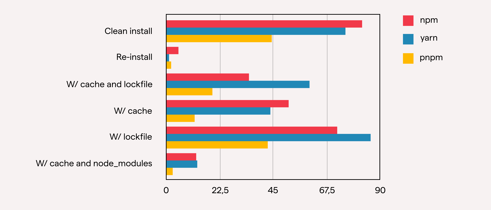
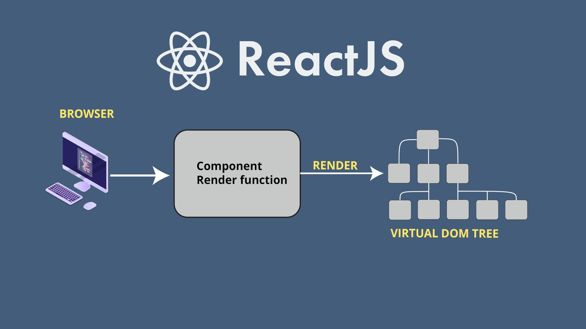
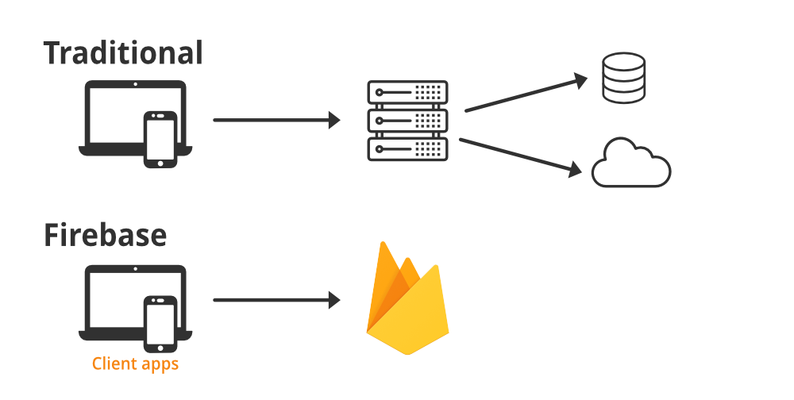
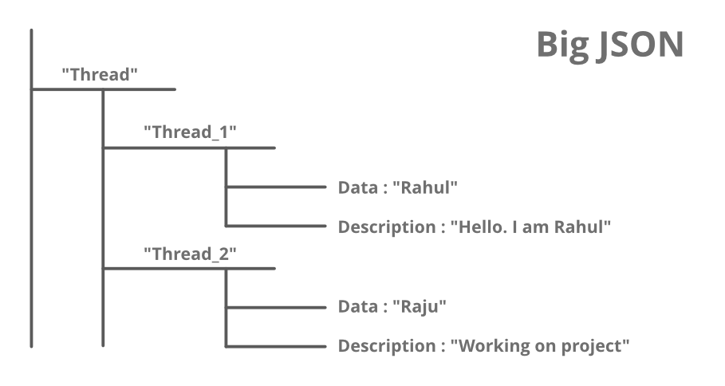
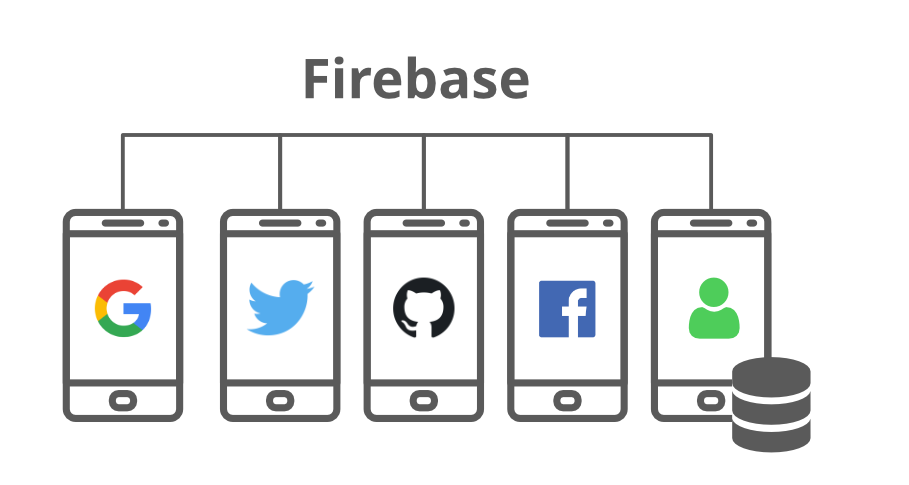

# React + Vite

This template provides a minimal setup to get React working in Vite with HMR and some ESLint rules.

Currently, two official plugins are available:

- [@vitejs/plugin-react](https://github.com/vitejs/vite-plugin-react/blob/main/packages/plugin-react/README.md) uses [Babel](https://babeljs.io/) for Fast Refresh
- [@vitejs/plugin-react-swc](https://github.com/vitejs/vite-plugin-react-swc) uses [SWC](https://swc.rs/) for Fast Refresh
  "# Dorm_Application"

## How to Install & Run
1. open cmd : git clone https://github.com/Krianapong/Dorm_Application.git
2. cd Dorm_Application
3. pnpm i
4. pnpm run dev

### Admin & User
- Admin
 ado@g.com
 123456

## Web Application

## Why is pnpm an option?
pnpm มีเป้าหมายที่ชัดเจน - ประหยัดพื้นที่ดิสก์, เพิ่มความเร็วในการติดตั้ง, และสร้างไดเรกทอรี node_modules ที่ไม่เป็นแบน

ข้อเสนอเหล่านี้โดดเด่นเมื่อเทียบกับตัวจัดการแพ็คเกจอื่น ๆ คนที่มีโปรเจค JavaScript หลายๆ ตัวบนเครื่องของพวกเขาจะรู้สึกว่าพื้นที่ดิสก์เป็นปัญหา; เนื่องจาก NPM และ Yarn ติดตั้ง dependencies เดียวกันสำหรับทุกๆ โปรเจค, ไม่มีการเก็บรวบรวมที่นี่ที่แอปพลิเคชันสามารถนำโค้ดมาใช้ใหม่ได้

ในทางความคิดของฉัน, ข้อได้เปรียบหลักคือเวลาติดตั้ง, ที่เกี่ยวข้องกับไดเรกทอรี node_modules ที่ไม่เป็นแบนและมีการเก็บรวบรวมที่สามารถใช้ dependencies ที่ดาวน์โหลดไว้แล้ว อัลกอริทึมสำหรับการสร้างต้นไม้แบนมีความเรียบง่ายมากกว่าที่ NPM และ Yarn ใช้, และวิธีที่ lock files ถูกสร้างทำให้กระบวนการดำเนินงานได้เร็วขึ้น

เหตุผลอื่น ๆ คือการมีที่เก็บกลางที่มีทุก package ที่ดาวน์โหลดและ dependencies ที่ได้รับการประมวลผลไว้แล้ว, ทำให้ง่ายต่อการมอบหมายให้กับโปรเจคที่ pnpm กำลังติดตั้ง dependencies นี้

## Performance comparison

อ้างอิง [https://www.pixelmatters.com/blog/yarn-npm-or-pnpm](https://www.pixelmatters.com/blog/yarn-npm-or-pnpm)

## Explaining JS frameworks and libraries
ความแตกต่างระหว่าง Frameworks และ Libraries อาจมีความหมายที่ละเอียดเทียบกับกัน แต่มันมีความสำคัญสำหรับนักพัฒนาที่มุ่งมั่นและผู้ที่สนใจเกี่ยวกับเทคโนโลยีต่างๆ ในขณะที่คำว่า "Framework" บางครั้งถูกดูถูกว่าเป็นคำโปรโมทแบบสุ่ม และคำว่า "Library" มีความหมายที่ชัดเจนมากขึ้น: คือการรวบรวม.

ตามที่นักพัฒนาที่มีประสบการณ์กล่าวไว้, Framework ซอฟต์แวร์คือการออกแบบที่สามารถใช้ซ้ำได้สำหรับระบบซอฟต์แวร์ที่รวมถึงโปรแกรมสนับสนุน, ไลบรารีโค้ด, ภาษาสคริปต์, และส่วนประกอบของซอฟต์แวร์อื่นๆ ที่ม contrib นำมาเสนอให้ใช้ในการพัฒนาและโครงสร้างโปรแกรมโดยรวม.

Framework ของ JavaScript (JS) ปฏิบัติตามหลักการที่สำคัญสามข้อที่ทำให้มันแตกต่างจากคอลเล็คชันอื่นๆ เช่นไลบรารี:

การพลิกควบคุม (Inversion of Control):

ใน Framework, การไหลของควบคุมแตกต่างจากแอปพลิเคชันมากมายคล้ายๆ กับนั่นคือไม่ได้ถูกควบคุมโดยผู้เรียกใช้ (นักพัฒนาที่ใช้ Framework), แต่ได้รับควบคุมจาก Framework ตนเอง. นี้หมายถึง Framework รับผิดชอบการควบคุมการทำงานทั้งหมดและนักพัฒนาเชื่อมต่อที่จุดที่ถูกกำหนดไว้ล่วงหน้า.
ความสามารถในการขยาย (Extensibility):

JS Frameworks ทำให้ผู้ใช้สามารถขยายฟังก์ชันของมันได้โดยการเพิ่มรหัสบางส่วน. นั่นหมายความว่านักพัฒนาสามารถปรับแต่งและเพิ่มความสามารถให้กับ Framework เพื่อตอบสนองต่อความต้องการของโปรเจคของพวกเขา. ความสามารถในการขยายนี้เป็นคุณสมบัติที่ทรงพลังที่ช่วยให้มีความยืดหยุ่นในการปรับแต่ง Framework ให้เหมาะกับความต้องการของแอปพลิเคชันต่างๆ.
โค้ด Framework ที่ไม่สามารถแก้ไขได้ (Non-Modifiable Framework Code):

ลักษณะหนึ่งของ JS Frameworks คือโค้ดหลักของ Framework มักจะไม่สามารถแก้ไขได้. นักพัฒนาสามารถขยายความสามารถของ Framework ได้โดยการเพิ่มรหัสของตนเอง, แต่พวกเขาไม่สามารถเปลี่ยนแปลงโค้ดหลักของ Framework ได้. ข้อจำกัดนี้ช่วยให้รักษาความสม่ำเสมอและความเสถียรในโครงสร้างหลักของ Framework.

## React – a JS Library
React ได้ค่อนข้างเร็วขึ้นมาบนลำดับหลักและกำลังรักษาตำแหน่งของมัน, ส่งเสริมการใช้วิธีการทำให้รีแอคทิฟและแนวคิดการพัฒนาแบบฟังก์ชัน. นอกจากนี้, มันยังเริ่มต้นแนวคิดที่กำหนดเอง, ซึ่งเป็นการเข้าใจที่ไม่เหมือนใคร. เพื่อเป็นผู้เชี่ยวชาญใน React, คุณหรือทีมของคุณต้องเริ่มคำนึงถึงโครงสร้างที่ใช้ component, JSX, และการไหลของข้อมูลแบบ Unidirectional ที่ถูกนำมาใช้โดย Flux หรือ Redux.

JavaScript libraries: React
แอปพลิเคชัน React ประกอบด้วย component หลาย ๆ ตัว. ไฟล์ component รวมถึงตรรกะทางธุรกิจและมาร์กอับ HTML (JSX markup -> ฟังก์ชัน JS).

Flux, Redux หรือไลบรารี JS ที่คล้ายกันให้การสื่อสารระหว่าง component. นอกจากนี้ React ก็ได้นำเสนอวัตถุพิเศษ: state และ props.

มีรายการที่ครอบคลุมไปทั่วของไลบรารีที่สามารถขยายความยืดหยุ่นของ React. อย่างไรก็ตาม, ข้อได้เสียนี้ลงไปในปัญหาความเสรี. เนื่องจาก, คุณอาจใช้เวลาที่ไม่จำเป็นในการเลือกว่าอะไรคือที่ดีที่สุด เนื่องจากการตัดสินใจในการทำให้เสร็จสิ้นหรือไม่เสร็จสิ้นเป็นงานอดิเรกที่ดี... ดังนั้นทำให้เกิดความรำคาญและเสียเวลาที่มีค่า. อีกครั้ง, พิจารณา React เป็นส่วนหนึ่งของ Framework หรือ Library ของ JS - คุณก็ถูกต้อง. แต่เราไม่ต้องการเริ่มสงครามโลกที่สาม, ดังนั้น...ในบทความนี้, เนื่องจากมันไม่มี IoC (Inversion of Control) จึง React เป็น Library ของ JS.

อ้างอิง [https://ebs-integrator.com/blog/5-js-frameworks-that-serve-you-well/](https://ebs-integrator.com/blog/5-js-frameworks-that-serve-you-well/)

## Firebase
Firebase เป็นผลิตภัณฑ์ของ Google ที่ช่วยให้นักพัฒนาซอฟต์แวร์สร้าง จัดการ และขยายแอปได้อย่างง่ายดาย ช่วยให้นักพัฒนาสร้างแอปได้เร็วขึ้นและปลอดภัยยิ่งขึ้น ไม่จําเป็นต้องเขียนโปรแกรมที่ด้าน firebase ซึ่งทําให้ง่ายต่อการใช้คุณสมบัติอย่างมีประสิทธิภาพมากขึ้น มันให้บริการแก่ Android, iOS, เว็บและความสามัคคี มันให้ที่เก็บข้อมูลบนคลาวด์ ใช้ NoSQL สําหรับฐานข้อมูลสําหรับการจัดเก็บข้อมูล

- 1 Realtime Database
    ฐานข้อมูลเรียลไทม์ของ Firebase เป็นฐานข้อมูล NoSQL บนคลาวด์ที่จัดการข้อมูลของคุณด้วยความเร็วที่เห็นได้ชัดของมิลลิวินาที ในระยะที่ง่ายที่สุดถือได้ว่าเป็นไฟล์ JSON ขนาดใหญ่

    

- 2 Cloud Firestore
    ระบบคลาวด์ Firestore เป็นฐานข้อมูลเอกสาร NoSQL ที่ให้บริการเช่นจัดเก็บซิงค์และสืบค้นผ่านแอปพลิเคชันในระดับโลก มันเก็บข้อมูลในรูปแบบของวัตถุที่เรียกว่าเอกสาร มีคู่คีย์-ค่าและสามารถจัดเก็บข้อมูลทุกประเภทเช่นสตริงข้อมูลไบนารีและแม้แต่ต้นไม้ JSON

    

- 3 Authentication
    บริการตรวจสอบสิทธิ์ Firebase มีไลบรารี UI และ SDK ที่ใช้งานง่ายเพื่อตรวจสอบสิทธิ์ผู้ใช้ในแอป ช่วยลดกําลังคนและความพยายามที่จําเป็นในการพัฒนาและบํารุงรักษาบริการตรวจสอบผู้ใช้ มันยังจัดการงานต่างๆเช่นการรวมบัญชีซึ่งหากทําด้วยตนเองอาจเป็นเรื่องวุ่นวาย

    

- 4 Cloud Firestore

    ให้การเชื่อมต่อระหว่างเซิร์ฟเวอร์และผู้ใช้ปลายทางของแอปพลิเคชัน ซึ่งสามารถใช้เพื่อรับและส่งข้อความและการแจ้งเตือนได้ การเชื่อมต่อเหล่านี้เชื่อถือได้และประหยัดแบตเตอรี่

    

    อ้างอิง [https://www.geeksforgeeks.org/firebase-introduction/](https://www.geeksforgeeks.org/firebase-introduction/)
